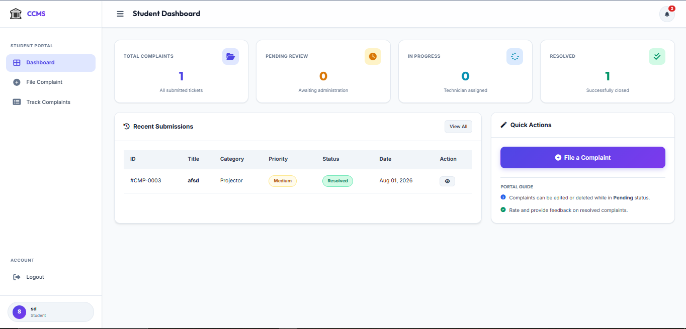
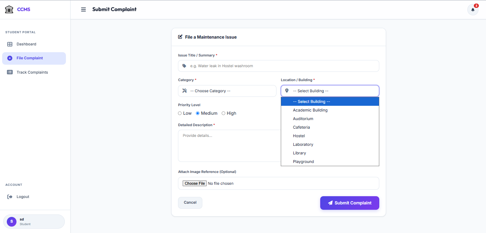
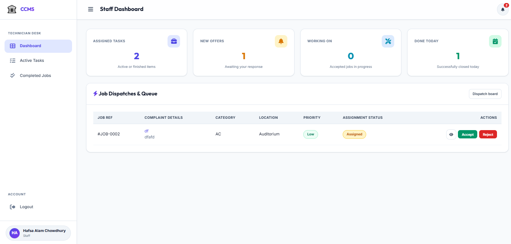
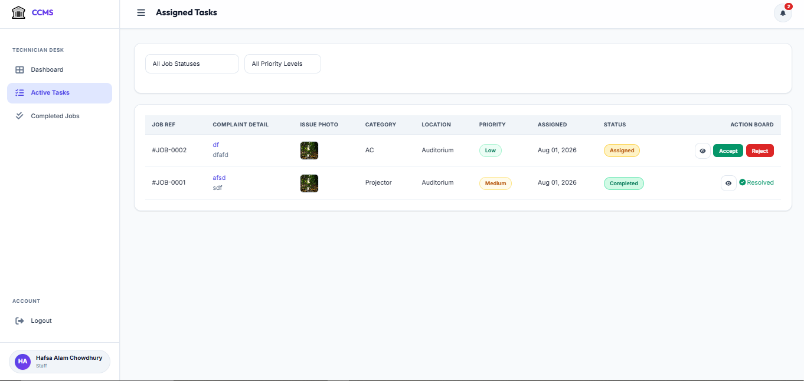
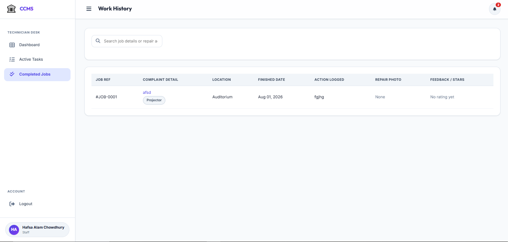
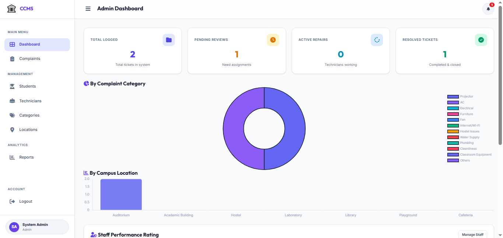
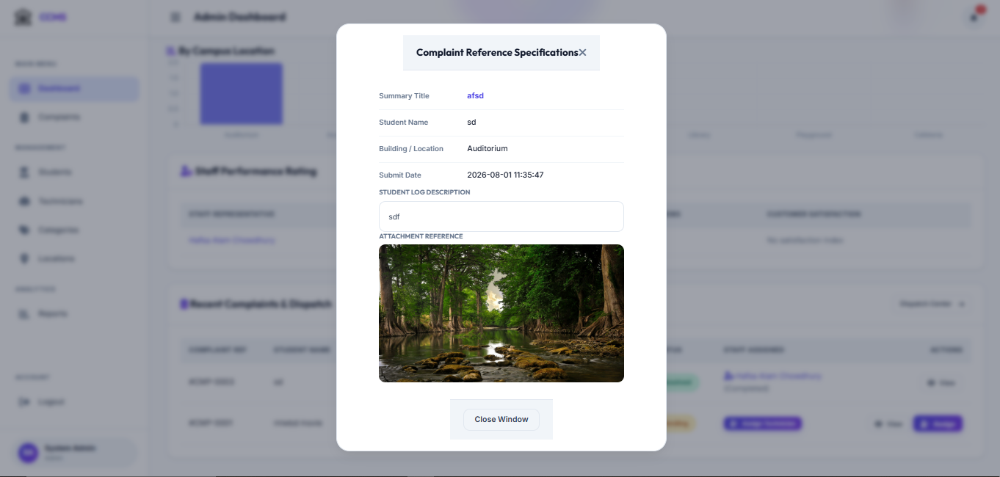
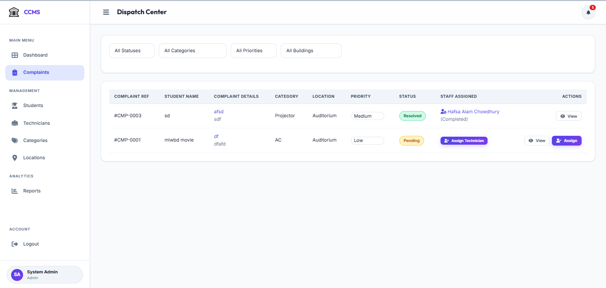
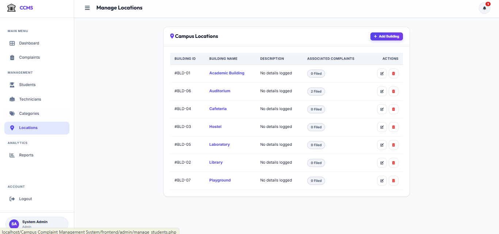
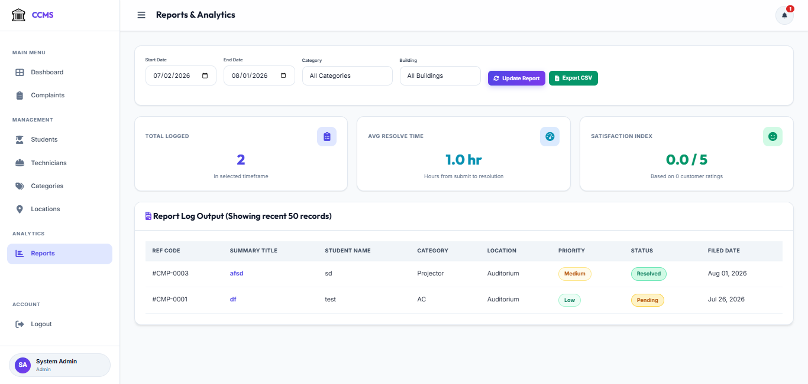

# Campus Complaint Management System

A MySQL-based database system for managing maintenance complaints within a university campus. The system allows students to report campus issues, administrators to assign maintenance staff, and staff members to update repair progress until the complaint is resolved.

---

## Project Overview

This project is designed to simplify the maintenance complaint process on a university campus by keeping all complaint records in a centralized database.

### User Roles

- **Student**
  - Submit complaints
  - Track complaint status
  - Provide feedback after resolution

- **Administrator**
  - Manage complaints
  - Assign maintenance staff
  - Monitor complaint progress

- **Maintenance Staff**
  - View assigned complaints
  - Update repair progress
  - Complete assigned work

---

## Database Structure

```
Users
│
├── Students
├── Admins
└── Maintenance Staff
        │
        ▼
    Complaints
        │
 ┌──────┼──────────┐
 ▼      ▼          ▼
Assignments  Complaint Updates  Feedback

Lookup Tables
--------------
• Buildings
• Complaint Categories
• Complaint Status

Notifications
```

---

## Database Tables

### users

Stores account information for every user.

| Field |
|------|
| user_id |
| name |
| email |
| phone |
| password |
| role |
| status |
| created_at |
| updated_at |

---

### students

Stores student-specific information.

| Field |
|------|
| student_id |
| user_id |
| student_number |
| department |
| semester |
| building_id |
| room_no |

---

### maintenance_staff

Stores maintenance employee information.

| Field |
|------|
| staff_id |
| user_id |
| employee_id |
| designation |
| specialization |
| phone |
| availability |

Availability values:

- Available
- Busy
- Offline

---

### admins

Stores administrator records linked with users.

---

### buildings

Stores the list of campus buildings.

Sample records include:

- Academic Building
- Library
- Hostel
- Cafeteria
- Laboratory
- Auditorium
- Playground

---

### complaint_categories

Stores complaint categories.

Examples:

- Electrical
- Plumbing
- Internet/Wi-Fi
- Projector
- Fan
- AC
- Furniture
- Hostel Issues
- Cleanliness
- Others

---

### complaint_status

Stores complaint status values.

- Pending
- Assigned
- Accepted
- In Progress
- Resolved
- Rejected
- Closed

---

### complaints

The main table of the system.

Stores:

- Student
- Category
- Building
- Status
- Title
- Description
- Image
- Priority
- Created Time
- Updated Time
- Resolved Time

Priority values:

- Low
- Medium
- High

Indexes are created on:

- student_id
- category_id
- status_id

---

### assignments

Stores maintenance assignments.

Includes:

- Assigned Staff
- Assigned By
- Assigned Date
- Accepted Date
- Completed Date
- Repair Notes
- Repair Image
- Assignment Status

Assignment status values:

- Assigned
- Accepted
- Rejected
- Completed

---

### complaint_updates

Stores progress updates made by maintenance staff.

Includes:

- Complaint
- Staff
- Status
- Progress Note
- Progress Image
- Created Time

---

### feedback

Allows students to rate completed complaints.

Stores:

- Rating (1–5)
- Comments
- Submission Date

---

### notifications

Stores notifications sent to users.

Includes:

- Title
- Message
- Read Status
- Created Time

---

## Complaint Workflow

```
Pending
   │
   ▼
Assigned
   │
   ▼
Accepted
   │
   ▼
In Progress
   │
   ▼
Resolved
   │
   ▼
Closed
```

If a complaint cannot be processed, it may be marked as:

```
Rejected
```

---

## Database Features

- Relational database using MySQL
- Primary and Foreign Key relationships
- Lookup tables
- ENUM data types
- CHECK constraint for feedback ratings
- Timestamp tracking
- Indexed complaint records
- Notification system
- Student feedback module
- Cascading delete support

---

## Referential Integrity

### ON DELETE CASCADE

Deleting a user automatically removes related records from:

- Students
- Maintenance Staff
- Admins
- Notifications

Deleting a complaint automatically removes:

- Assignments
- Complaint Updates
- Feedback

### ON DELETE SET NULL

If a building is deleted, the building reference in the **Students** table is automatically set to **NULL**.

---

## Sample Data

The SQL script includes sample data for:

- 7 Buildings
- 12 Complaint Categories
- 7 Complaint Statuses
- 1 Administrator
- 5 Students
- 2 Maintenance Staff
- Sample Complaints
- Assignments
- Complaint Updates
- Feedback
- Notifications

---

## Default Administrator

| Email | Password |
|--------|----------|
| admin@campus.edu | admin123 |


---

## Technologies Used

- MySQL
- SQL
- Relational Database Design
- Foreign Keys
- Constraints
- Indexing

---

## Team Members

- **Hafsa Alam Chowdhury**
- **Khadija Haque Zara**

---

## Project Objective

The objective of this project is to develop a database system that helps universities manage maintenance complaints efficiently. Students can report campus issues, administrators can assign maintenance staff, and maintenance staff can update repair progress until the complaint is resolved. The system keeps complaint information organized and maintains a complete history of every complaint.

---

## 🎨 Application Interfaces & Feature Showcase

All screenshots and visual assets are located in the `showcase/` directory.

### 🎓 Student Portal (`s1` – `s5`)

| View | Asset Path | Description |
| :--- | :--- | :--- |
| **Student Dashboard** | `showcase/s1.png` | Overview desk displaying current ticket counters (Pending, In Progress, Resolved) and recent ticket history. |
| **Notifications Drawer** | `showcase/s2.png` | Notification panel showing real-time updates when technicians accept tasks or resolve issues. |
| **Submit Complaint** | `showcase/s3.png` | Ticket filing form equipped with building selectors, category pickers, priority options, and image uploader. |
| **My Complaints Listing** | `showcase/s4_2.png` | Student tracking table featuring live status badges and quick inspection buttons. |
| **Track & Rate Complaint** | `showcase/s5_2.png` | Comprehensive ticket detail view displaying repair timelines, staff notes, issue photo, and a 5-star rating submission form. |

#### Student Portal Page Previews

##### Student Dashboard (`s1.png`)

*Overview showing ticket counters, recent submissions, and quick action shortcuts.*

##### Submit Complaint Form (`s3.png`)

*Interface for filing a new maintenance request with location and category dropdowns.*

##### Track Complaint & Feedback (`s5_2.png`)

*Detailed tracking view with repair history timeline and 5-star resolution rating form.*

---

### 🔧 Technician Desk (`t1` – `t3`)

| View | Asset Path | Description |
| :--- | :--- | :--- |
| **Staff Dashboard** | `showcase/t1.png` | Workboard overview displaying task metrics (Assigned Tasks, New Offers, Working On, Done Today) and the dispatch queue. |
| **Active Tasks & Action Board** | `showcase/t2.png` | Task management workspace featuring Accept/Reject buttons, issue photo thumbnails, and job status badges. |
| **Work History Log** | `showcase/t3.png` | Archive of finished jobs displaying completion dates, logged repair actions, repair photo links, and student ratings. |

#### Technician Desk Page Previews

##### Technician Staff Dashboard (`t1.png`)

*Main technician overview displaying active metric cards and the job dispatch queue.*

##### Active Tasks & Action Board (`t2.png`)

*Task management board allowing technicians to review and update work status.*

##### Completed Work History (`t3.png`)

*Archive of finished repair jobs with repair logs and student rating indicators.*

---

### 🛡️ System Administration Panel (`1` – `12`)

| View | Asset Path | Description |
| :--- | :--- | :--- |
| **Admin Login Screen** | `showcase/1.png` | Standard login portal for system administrators. |
| **Admin Login (Active State)** | `showcase/2.png` | Active login interface showing interactive form fields and system branding. |
| **Executive Dashboard** | `showcase/3.png` | High-level system dashboard displaying key KPI stats and overall ticket analytics charts. |
| **Notifications Overlay** | `showcase/4.png` | Real-time administrative alert menu tracking continuous system actions and complaint triggers. |
| **Staff Performance & Queue** | `showcase/5.png` | Operational dashboard showing staff dispatch workloads and recent assignment activities. |
| **Complaint Specifications Modal** | `showcase/6.png` | Detailed inspection modal displaying complete complaint metadata, location details, and ticket logs. |
| **Dispatch Center** | `showcase/7.png` | Main complaint registry for managing tickets, assigning technicians, and updating priority levels. |
| **Student Directory** | `showcase/8.png` | User management module for searching, adding, editing, or restricting student profiles. |
| **Technician Management** | `showcase/9.png` | Staff directory for managing maintenance technician accounts, contact details, and job logs. |
| **Category Management** | `showcase/10.png` | Categorization workspace for adding or modifying issue types (e.g., Electrical, Plumbing, Projector). |
| **Location & Campus Buildings** | `showcase/11.png` | Campus location manager listing facilities along with their real-time complaint counts. |
| **Reports & Analytics Engine** | `showcase/12.png` | Reporting tool featuring date/location filters, average resolution time metrics, and CSV exports. |

#### Admin Panel Essential Page Previews

##### Executive Dashboard (`3.png`)

*Executive dashboard presenting real-time system metrics, ticket breakdown, and activity graphs.*

##### Complaint Specifications Modal (`6.png`)

*Modal window for inspecting complaint details, technician assignments, and history logs.*

##### Dispatch Center (`7.png`)

*Central complaint management registry for direct technician assignment and ticket management.*

##### Manage Campus Locations (`11.png`)

*Campus building directory tracking total associated complaints for each campus location.*

##### Reports & Analytics Engine (`12.png`)

*Analytics desk with date/building filters, resolution speed metrics, and CSV export functionality.*
